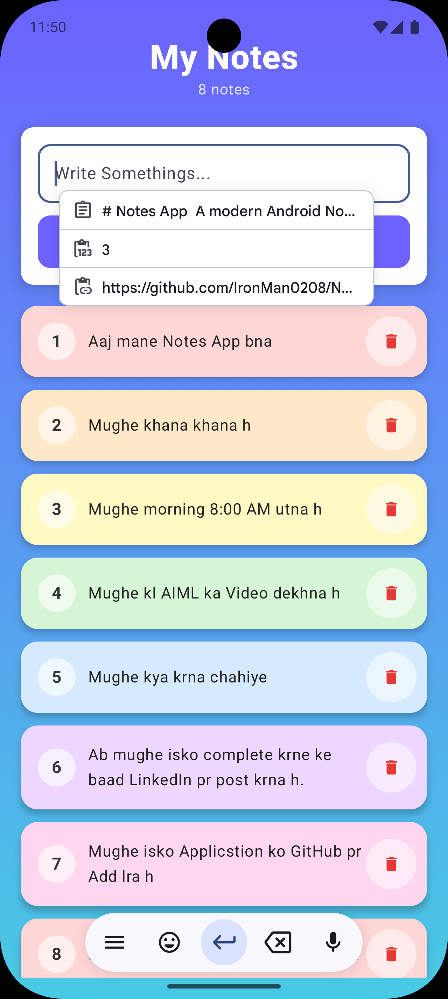

# 📝 Notes App

A modern Android Notes Application built with **Kotlin**, **Jetpack Compose**, and **Room Database**. The app allows users to create, view, and delete notes with a clean UI while storing data locally using Room, ensuring notes remain available even after restarting the app.

---

## ✨ Features

* 📝 Create Notes
* 🗑️ Delete Notes
* 📋 View All Notes
* 💾 Local Data Persistence using Room Database
* ⚡ Fast and Responsive UI
* 🎨 Modern Material 3 Design
* 🏗️ MVVM Architecture
* 📦 Repository Pattern

---

## 🛠 Tech Stack

* Kotlin
* Jetpack Compose
* Material 3
* Room Database
* MVVM Architecture
* Repository Pattern
* Coroutines
* ViewModel
* State Management

---

<<<<<<< HEAD
## 📂 Project Structure
=======
<p align="center">
  
</p>

>>>>>>> c3481f1ae26c71e7c2fe136d37280928e0bc5681

```text
com.chotu.notes

├── data
│   ├── dao
│   ├── database
│   └── entity
│
├── repository
│
├── viewmodel
│
└── ui
```

---

## 📸 Screenshots

<p align="center">
  
</p>

---

## 🚀 Installation

### 1. Clone the Repository

```bash
git clone https://github.com/IronMan0208/Notes-App.git
```

### 2. Open in Android Studio

Open the project using the latest version of Android Studio.

### 3. Build and Run

Run the application on an Android Emulator or Physical Device.

---

<<<<<<< HEAD
## 🧠 What I Learned

* Jetpack Compose UI Development
* State Management in Compose
* Room Database Integration
* MVVM Architecture
* Repository Pattern
* ViewModel & ViewModel Factory
* Coroutines
* Local Data Persistence
* Clean Project Structure

---

## 🔮 Future Improvements

* ✏️ Edit Notes
* 🔍 Search Notes
* 🌙 Dark Mode
* 🏷️ Categories & Tags
* ☁️ Cloud Sync
* 📤 Share Notes
* 📌 Pin Important Notes

---

## 👨‍💻 Author

**Ajay Kumar**

Aspiring Android Developer focused on building modern Android applications using Kotlin, Jetpack Compose, MVVM Architecture, Room Database, and Clean Architecture principles.

🔗 GitHub: https://github.com/IronMan0208

---

## ⭐ Support

If you found this project helpful, consider giving it a ⭐ on GitHub.
=======
Ajay Kumar
>>>>>>> c3481f1ae26c71e7c2fe136d37280928e0bc5681
